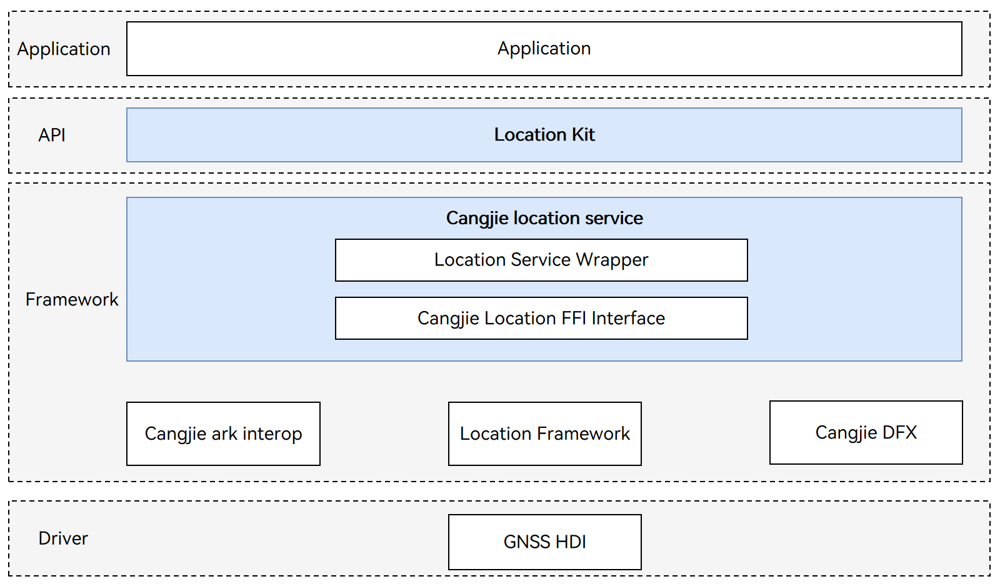

# location_cangjie_wrapper

## Introduction

The location_cangjie_wrapper is a Cangjie API encapsulated on OpenHarmony for developers to use location service capabilities for application development. The system's location capability can provide real-time and accurate location data. For developers, designing location-based services can make the application experience more personalized for each user. The currently open location service Cangjie interface only supports standard devices.

**Basic Concepts**

Location capability is used to determine where the user's device is located. The system uses location coordinates to indicate the device's position and provides services through GNSS positioning technology. Through these positioning technologies, the device's location can be accurately determined whether the user's device is indoors or outdoors.

-   **Coordinate**

    The system uses the World Geodetic System 1984 as a reference, using longitude and latitude data to describe a location on Earth.

-   **GNSS positioning**

    Based on the Global Navigation Satellite System, including GPS, GLONASS, BeiDou, Galileo, etc., it determines the device's accurate location through navigation satellites and the positioning algorithms provided by the device chip. The specific positioning systems used in the positioning process depend on the hardware capabilities of the user's device.

## System Architecture

**Figure 1** location_cangjie_wrapper architecture**  



As illustrated in the architecture diagram:

Interface layer description:

- Location Service API: Provides Cangjie public interface declarations for obtaining the current location and checking if the location service is enabled. When using the location service API, please turn on the device's "Location" switch.

Framework layer description:

- Location Service Wrapper: Provides Cangjie encapsulation method implementations for obtaining the current location and checking if the location service is enabled. This encapsulation layer is a Cangjie encapsulation implementation of location service functionality based on the location service component.

Cangjie Location Service Dependencies:

- cangjie_ark_interop: Encapsulates public interfaces for C language interoperation, and provides Cangjie tag class implementation for annotating Cangjie APIs, as well as providing BusinessException exception class definitions thrown to users.
- Location Service Component: Provides basic functions such as GNSS positioning, network positioning (cellular base station, WLAN, Bluetooth positioning technology), geocoding, country code, and geofencing by calling underlying GNSS driver interfaces.
- hiviewdfx_cangjie_wrapper: Responsible for providing log interfaces, providing Cangjie interfaces that can be called by the location service Cangjie interface to print logs at critical paths.

## Directory Structure

```
base/location/location_cangjie_wrapper
├── figures                           # architecture pictures
├── kit                               # Cangjie kit code
│   └── LocationKit                   # Cangjie LocationKit code
├── ohos                              # Cangjie Location code
│   └── geo_location_manager          # Cangjie geo_location_manager code
└── test                              # Test cases
    └── geolocationmanager            # Location manager tests
        └── test                      # Location manager test project
```

## Usage

The following location service functions have been provided:

- Obtains the current location.
- Checks whether the location service is enabled.

For APIs related to location, please refer to [geo_location_manager API Reference](https://gitcode.com/openharmony-sig/arkcompiler_cangjie_ark_interop/tree/master/doc/API_Reference/source_en/apis/LocationKit). Please refer to [Location Development Guide](https://gitcode.com/openharmony-sig/arkcompiler_cangjie_ark_interop/tree/master/doc/Dev_Guide/source_en/location/cj-location-guidelines.md) for related guidance.

## Constraints

Your application can use the location function only after the user has granted the permission and turned on the function. If the location function is off, the system will not provide the location service for any application.

Since the location information is considered sensitive, your application still needs to obtain the location access permission from the user even if the user has turned on the location function. The system will provide the location service for your application only after it has been granted the permission to access the device location information.

Compared with the API capabilities provided by ArkTS, the following functionalities are currently not supported:

- Network positioning: Including cellular base station positioning, WLAN positioning, and Bluetooth positioning technology.
- Historical location acquisition: Obtaining the most recently cached location information.
- Geofencing services: Geofencing is a virtual geographic boundary function that can receive automatic notifications and alerts when a device enters or leaves a specific geographic area.
- Geocoding services: The geocoding function provides conversion between address information and geographic coordinates.
- Location listener services: Supports registering location change listeners to continuously receive location updates.
- Location status management: Determining whether the geocoding service is available and obtaining country code information.

## Code Contribution

Developers are welcome to contribute code, documentation, etc. For specific contribution processes and methods, please refer to [Code Contribution](https://gitcode.com/openharmony/docs/blob/master/en/contribute/code-contribution.md).

## Repositories Involved

[base_location](https://gitcode.com/openharmony/base_location/blob/master/README.md)

[arkcompiler_cangjie_ark_interop](https://gitcode.com/openharmony-sig/arkcompiler_cangjie_ark_interop/blob/master/README.md)

[hiviewdfx_hiviewdfx_cangjie_wrapper](https://gitcode.com/openharmony-sig/hiviewdfx_hiviewdfx_cangjie_wrapper/blob/master/README.md)