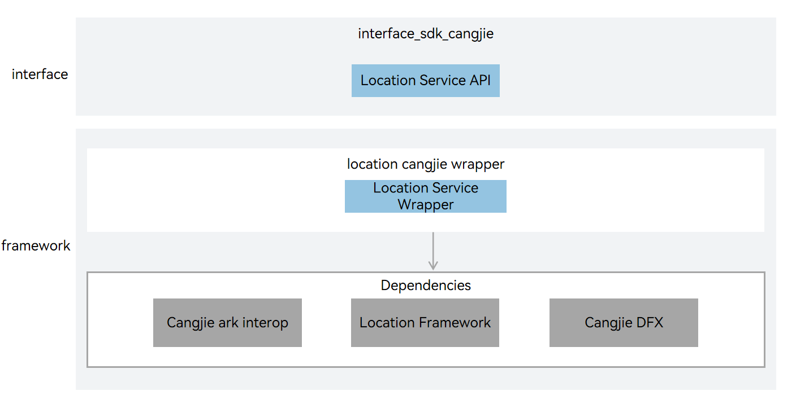

# location_cangjie_wrapper

## Introduction

The location_cangjie_wrapper is a Cangjie API encapsulated on OpenHarmony based on the capabilities of the Location Component. Mobile terminal devices have been deeply integrated into all aspects of people's daily lives, such as checking the weather in their city, news stories, calling for rides, travel navigation, and fitness tracking. These common activities all rely on locating the user's terminal device.

When users are in these rich usage scenarios, the system's location capability can provide real-time and accurate location data. For developers, designing location-based services can make the application experience more personalized for each user.

When applications implement device location-based features, such as driving navigation or recording exercise routes, they can call the module's API interfaces to obtain location information.

The currently open location service Cangjie interface only supports standard devices.

**Basic Concepts**

Location capability is used to determine where the user's device is located. The system uses location coordinates to indicate the device's position and provides services through multiple positioning technologies, such as GNSS positioning, base station positioning, and WLAN/Bluetooth positioning (base station positioning, WLAN/Bluetooth positioning are collectively referred to as "network positioning technology"). Through these positioning technologies, the device's location can be accurately determined whether the user's device is indoors or outdoors.

-   **Coordinate**

    The system uses the World Geodetic System 1984 as a reference, using longitude and latitude data to describe a location on Earth.

-   **GNSS positioning**

    Based on the Global Navigation Satellite System, including GPS, GLONASS, BeiDou, Galileo, etc., it determines the device's accurate location through navigation satellites and the positioning algorithms provided by the device chip. The specific positioning systems used in the positioning process depend on the hardware capabilities of the user's device.

-   **Base station positioning**

    Estimates the device's current location based on the position of the current network base station and neighboring base stations. The positioning accuracy of this method is relatively low and requires the device to access the cellular network.

-   **WLAN and Bluetooth positioning**

    Estimates the device's current location based on the positions of surrounding WLAN and Bluetooth devices that can be detected by the device. The positioning accuracy of this method depends on the distribution of visible fixed WLAN and Bluetooth devices around the device. When the density is high, the accuracy is higher compared to base station positioning, and it also requires the device to access the network.

**Figure 1** location_cangjie_wrapper architecture**  



As illustrated in the architecture diagram:

Interface layer description:

- Location Service API: Cangjie public interfaces based on location service encapsulation exposed to users.

Framework layer description:

- Location Service Wrapper: Provides Cangjie encapsulation method implementations for obtaining the current location and checking if the location service is enabled.
- Cangjie Location Services FFI Wrapper Definition: Responsible for defining the C language interoperability interface for Cangjie, aimed at implementing Cangjie location service capabilities.

Cangjie Location Service Dependencies:

- Cangjie Interop: Encapsulates public interfaces for C language interoperation, and provides Cangjie tag class implementation for annotating Cangjie APIs, as well as providing BusinessException exception class definitions thrown to users.
- Location Service Framework: Provides C language interfaces for basic location services that can be called by the location service Cangjie interface through calling underlying GNSS driver interfaces.
- Cangjie DFX: Responsible for providing log interfaces, providing Cangjie interfaces that can be called by the location service Cangjie interface to print logs at critical paths.

## Directory Structure

```
base/location/location_cangjie_wrapper
├── figures                           # architecture pictures
├── kit                               # Cangjie kit code
│   └── LocationKit                   # Cangjie LocationKit code
├── ohos                              # Cangjie Location code
│   └── geo_location_manager          # Cangjie geo_location_manager code
└── test                              # Test cases
    └── geolocationmanager            # Location manager tests
        └── test                      # Location manager test project
```

## Usage

The following location service functions have been provided:

- Obtains the current location.
- Checks whether the location service is enabled.

For APIs related to location, please refer to [geo_location_manager API Reference](https://gitcode.com/openharmony-sig/arkcompiler_cangjie_ark_interop/tree/master/doc/API_Reference/source_en/apis/LocationKit). Please refer to [Location Development Guide](https://gitcode.com/openharmony-sig/arkcompiler_cangjie_ark_interop/tree/master/doc/Dev_Guide/source_en/location/cj-location-guidelines.md) for related guidance.

## Constraints

Your application can use the location function only after the user has granted the permission and turned on the function. If the location function is off, the system will not provide the location service for any application.

Since the location information is considered sensitive, your application still needs to obtain the location access permission from the user even if the user has turned on the location function. The system will provide the location service for your application only after it has been granted the permission to access the device location information.

Compared with the API capabilities provided by ArkTS, the following functionalities are currently not supported:

- Registers a listener for location changes with a location request initiated.
- Unregisters the listener for location changes with the corresponding location request deleted.
- Registers a listener for location service status change events.
- Unregisters the listener for location service status change events.
- Registers a listener for cached GNSS location reports.
- Unregisters the listener for cached GNSS location reports.
- Registers a listener for satellite status change events.
- Unregisters the listener for satellite status change events.
- Registers a listener for GNSS NMEA message change events.
- Unregisters the listener for GNSS NMEA message change events.
- Registers a listener for status change events of the specified geofence.
- Unregisters the listener for status change events of the specified geofence.
- Obtains the previous location.
- Requests to enable the location service. 
- Enables the location service.
- Disables the location service. 
- Obtains the number of cached GNSS locations.
- Obtains all cached GNSS locations and clears the GNSS cache queue. 
- Sends extended commands to the location subsystem. 
- Checks whether a user agrees with the privacy statement of the location service. 
- Sets the user confirmation status for the privacy statement of the location service.

## Code Contribution

Developers are welcome to contribute code, documentation, etc. For specific contribution processes and methods, please refer to [Code Contribution](https://gitcode.com/openharmony/docs/blob/master/en/contribute/code-contribution.md).

## Repositories Involved

[base_location](https://gitcode.com/openharmony/base_location/blob/master/README.md)

[arkcompiler_cangjie_ark_interop](https://gitcode.com/openharmony-sig/arkcompiler_cangjie_ark_interop/blob/master/README.md)

[hiviewdfx_hiviewdfx_cangjie_wrapper](https://gitcode.com/openharmony-sig/hiviewdfx_hiviewdfx_cangjie_wrapper/blob/master/README.md)