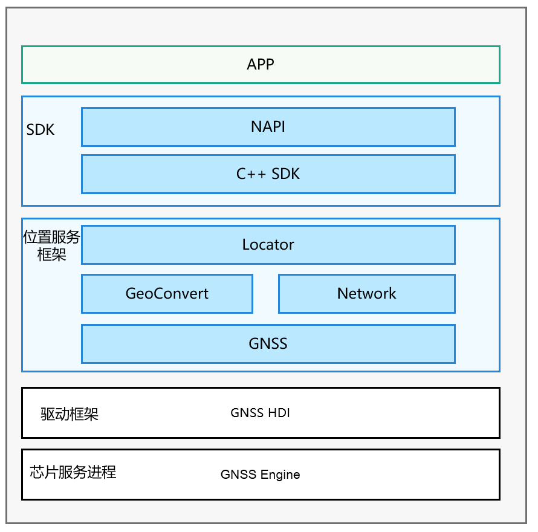

# 位置服务子系统

## 简介

移动终端设备已经深入人们日常生活的方方面面，如查看所在城市的天气、新闻轶事、出行打车、旅行导航、运动记录。这些习以为常的活动，都离不开定位用户终端设备的位置。

当用户处于这些丰富的使用场景中时，系统的位置能力可以提供实时准确的位置数据。对于开发者，设计基于位置体验的服务，也可以使应用的使用体验更贴近每个用户。

当应用在实现基于设备位置的功能时，如：驾车导航，记录运动轨迹等，可以调用该模块的API接口，完成位置信息的获取。

**基本概念**

位置能力用于确定用户设备在哪里，系统使用位置坐标标示设备的位置，并用多种定位技术提供服务，如GNSS定位、基站定位、WLAN/蓝牙定位（基站定位、WLAN/蓝牙定位后续统称“网络定位技术”）。通过这些定位技术，无论用户设备在室内或是户外，都可以准确地确定设备位置。

-   **坐标**

    系统以1984年世界大地坐标系统为参考，使用经度、纬度数据描述地球上的一个位置。

-   **GNSS定位**

    基于全球导航卫星系统，包含：GPS、GLONASS、北斗、Galileo等，通过导航卫星，设备芯片提供的定位算法，来确定设备准确位置。定位过程具体使用哪些定位系统，取决于用户设备的硬件能力。

-   **基站定位**

    根据设备当前驻网基站和相邻基站的位置，估算设备当前位置。此定位方式的定位结果精度相对较低，并且需要设备可以访问蜂窝网络。

-   **WLAN、蓝牙定位**

    根据设备可搜索到的周围WLAN、蓝牙设备位置，估算设备当前位置。此定位方式的定位结果精度依赖设备周围可见的固定WLAN、蓝牙设备的分布，密度较高时，精度也相较于基站定位方式更高，同时也需要设备可以访问网络。


**图 1** **子系统架构图**  




## 目录

```
base/location/location_cangjie_wrapper
├── ohos             # 仓颉位置服务接口实现
├── kit              # 仓颉kit化代码
├── figures          # 存放readme中的架构图
```

## 约束

使用设备的位置能力，需要用户进行确认并主动开启位置开关。如果位置开关没有开启，系统不会向任何应用提供位置服务。

设备位置信息属于用户敏感数据，所以即使用户已经开启位置开关，应用在获取设备位置前仍需向用户申请位置访问权限。在用户确认允许后，系统才会向应用提供位置服务。

## 相关仓

**位置服务子系统**

location_cangjie_wrapper
