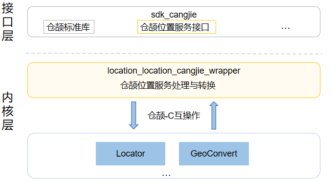

# 位置服务仓颉接口

## 简介

位置服务仓颉接口是在 OpenHarmony 上基于位置服务子系统能力之上封装的仓颉API。移动终端设备已经深入人们日常生活的方方面面，如查看所在城市的天气、新闻轶事、出行打车、旅行导航、运动记录。这些习以为常的活动，都离不开定位用户终端设备的位置。

当用户处于这些丰富的使用场景中时，系统的位置能力可以提供实时准确的位置数据。对于开发者，设计基于位置体验的服务，也可以使应用的使用体验更贴近每个用户。

当应用在实现基于设备位置的功能时，如：驾车导航，记录运动轨迹等，可以调用该模块的API接口，完成位置信息的获取。

当前开放的位置服务仓颉接口仅支持standard设备。

**基本概念**

位置能力用于确定用户设备在哪里，系统使用位置坐标标示设备的位置，并用多种定位技术提供服务，如GNSS定位、基站定位、WLAN/蓝牙定位（基站定位、WLAN/蓝牙定位后续统称"网络定位技术"）。通过这些定位技术，无论用户设备在室内或是户外，都可以准确地确定设备位置。

-   **坐标**

    系统以1984年世界大地坐标系统为参考，使用经度、纬度数据描述地球上的一个位置。

-   **GNSS定位**

    基于全球导航卫星系统，包含：GPS、GLONASS、北斗、Galileo等，通过导航卫星，设备芯片提供的定位算法，来确定设备准确位置。定位过程具体使用哪些定位系统，取决于用户设备的硬件能力。

-   **基站定位**

    根据设备当前驻网基站和相邻基站的位置，估算设备当前位置。此定位方式的定位结果精度相对较低，并且需要设备可以访问蜂窝网络。

-   **WLAN、蓝牙定位**

    根据设备可搜索到的周围WLAN、蓝牙设备位置，估算设备当前位置。此定位方式的定位结果精度依赖设备周围可见的固定WLAN、蓝牙设备的分布，密度较高时，精度也相较于基站定位方式更高，同时也需要设备可以访问网络。

**图 1** **子系统架构图**  



如架构图所示：

- 位置服务封装：提供获取当前位置的方法，提供判断位置服务是否开启的方法。
- 仓颉位置服务 FFI封装定义：负责定义被Cangjie语言调用的C语言互操作接口，用于实现仓颉位置服务能力。
- 位置服务框架：负责提供位置服务基本功能，封装C接口提供给仓颉进行互操作。

## 目录

```
base/location/location_cangjie_wrapper
├── figures                           # 存放README中的架构图
├── kit                               # 仓颉位置服务kit化代码
│   └── LocationKit                   # LocationKit代码目录
├── ohos                              # 仓颉位置服务接口实现
│   └── geo_location_manager          # geo_location_manager仓颉接口代码目录
└── test                              # 测试用例代码
    └── APILevel22                    # API Level 22测试代码
        └── geolocationmanager        # 位置管理测试
            └── test                  # 位置管理测试工程
```

## 约束

使用设备的位置能力，需要用户进行确认并主动开启位置开关。如果位置开关没有开启，系统不会向任何应用提供位置服务。

设备位置信息属于用户敏感数据，所以即使用户已经开启位置开关，应用在获取设备位置前仍需向用户申请位置访问权限。在用户确认允许后，系统才会向应用提供位置服务。

## 使用说明

提供了以下位置服务功能：
- 获取当前位置功能
- 判断位置服务是否已经打开功能

与ArkTS提供的API能力相比，暂不支持以下功能：
- 开启位置变化订阅，并发起定位请求
- 关闭位置变化订阅，并删除对应的定位请求
- 订阅位置服务状态变化
- 取消订阅位置服务状态变化
- 订阅缓存GNSS位置上报
- 取消订阅缓存GNSS位置上报
- 订阅卫星状态信息更新事件
- 取消订阅卫星状态信息更新事件
- 订阅GNSS NMEA信息上报
- 取消订阅GNSS NMEA信息上报
- 添加围栏，并订阅该围栏事件上报
- 删除围栏，并取消订阅该围栏事件
- 获取上一次位置
- 请求打开位置服务
- 打开位置服务
- 关闭位置服务
- 获取缓存GNSS位置的个数
- 获取所有的GNSS缓存位置，并清空GNSS缓存队列
- 给位置服务子系统发送扩展命令
- 查询用户是否同意定位服务的隐私申明
- 设置并记录用户是否同意定位服务的隐私申明

Location相关API使用请参见[geo_location_manager API 参考](https://gitcode.com/openharmony-sig/arkcompiler_cangjie_ark_interop/tree/master/doc/API_Reference/source_zh_cn/apis/LocationKit)，相关接口使用指导请参见[Location开发指南](https://gitcode.com/openharmony-sig/arkcompiler_cangjie_ark_interop/tree/master/doc/Dev_Guide/source_zh_cn/location/cj-location-guidelines.md)。

## 参与贡献

欢迎广大开发者贡献代码、文档等，具体的贡献流程和方式请参见[参与贡献](https://gitcode.com/openharmony/docs/blob/master/zh-cn/contribute/%E5%8F%82%E4%B8%8E%E8%B4%A1%E7%8C%AE.md)。

## 相关仓

**位置服务仓颉**

[base_location](https://gitcode.com/openharmony/base_location/blob/master/README.md)

[arkcompiler_cangjie_ark_interop](https://gitcode.com/openharmony-sig/arkcompiler_cangjie_ark_interop/blob/master/README_zh.md)


[hiviewdfx_hiviewdfx_cangjie_wrapper](https://gitcode.com/openharmony-sig/hiviewdfx_hiviewdfx_cangjie_wrapper/blob/master/README_zh.md)